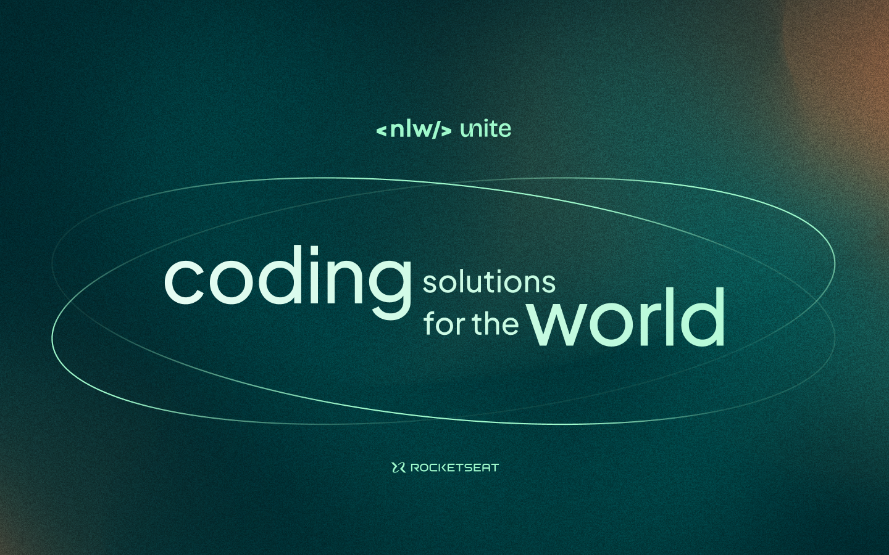

## Aplicação de gestão de participantes em eventos presenciais.

## :computer: Projeto
Esta aplicação foi desenvolvida na **NLW Unite da Rocketseat**.\
As suas funções são:
* A ferramenta permite que o organizador cadastre um evento e abra uma página pública de inscrição.
* Os participantes inscritos podem emitir uma credencial para check-in no dia do evento.
* O sistema fará um scan da credencial do participante para permitir a entrada no evento.

## :bookmark_tabs: Requisitos

### Requisitos Funcionais
* O organizador deve poder cadastrar um novo evento.
* O organizador deve poder visualizar dados de um evento.
* O organizador deve poder visualizar a lista de participantes.
* O participante deve poder se inscrever em um evento.
* O participante deve poder visualizar seu crachá de inscrição.
* O participante deve poder realizar check-in no evento.

### Requisitos Não Funcionais
* O check-in no evento será realizado através de um QRCode;

### Regras de Negócio
* O participante só pode se inscrever em um evento uma única vez.
* O participante só pode se inscrever em eventos com vagas disponíveis.
* O participante só pode realizar check-in em um evento uma única vez.

## :white_check_mark: Tecnologias utilizadas
- `Java 17`
- `Spring Boot`
- `Maven`
- `Lombok`
- `HyperSQL`
- `Insomnia`